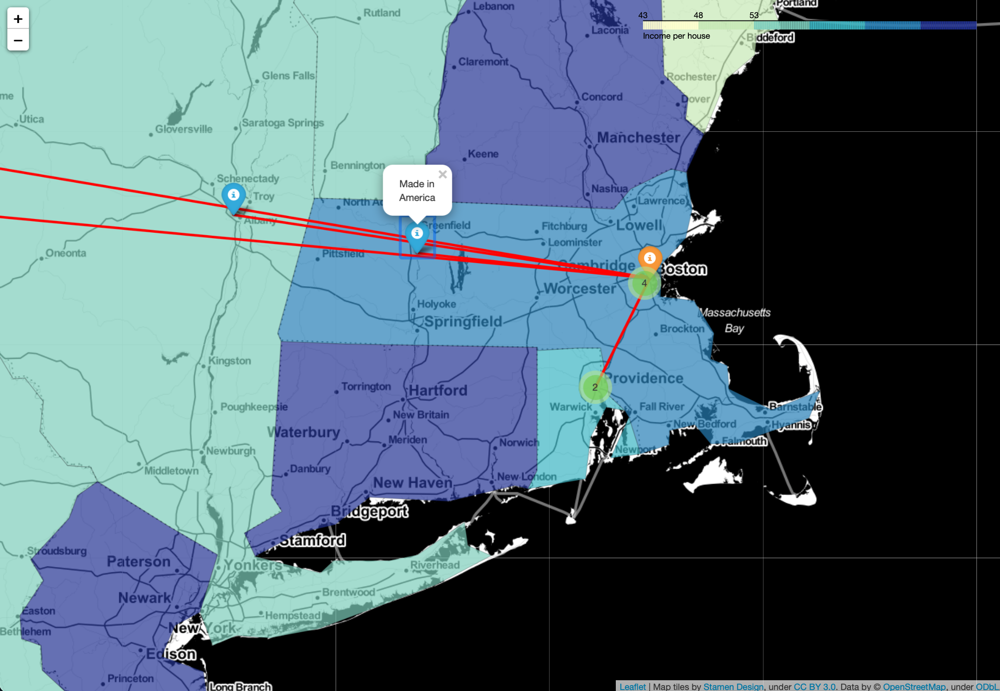
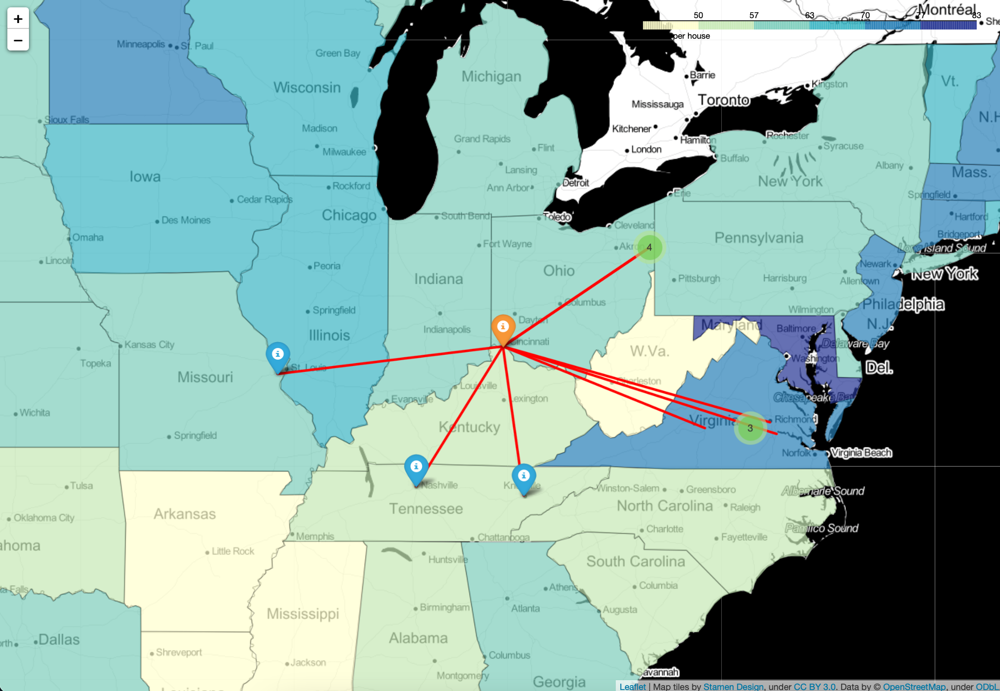

# MAP FILMS
# Python 3.9 is required!!!
## Сreates a web map, which should display information about the nearest places, where the films were shot (to the place specified by the user), which were shot in a given year.
<br>

## Creates also a layer of income per household in each of states, which can be used to determine popularity and profit of making films in certain year. Long strory short, starting from 1984 each year movie macking is sligtly shifting to states with bigger income, which tells us, that this sphere is profitable
<br>

## Module creates html file, which consist of basic tags and powerful js scriprs, along with bunch of geojson, which state for income layer

# Examples of execution:
```
Please enter a year you would like to have a map for: 
2003
Please enter your location (city or etc.): 
Boston
If you want execute the programme in fast mode, write "y", otherwise, press Enter
y
Loading formatted geocoded file...
Your map was succesfully created at map.html, It has taken 14.78s. to execute
```


<hr>

```
Please enter a year you would like to have a map for: 
2017
Please enter your location (city or etc.): 
Cincinnati
If you want execute the programme in fast mode, write "y", otherwise, press Enter

Loading formatted geocoded file...
Your map was succesfully created at map.html, It has taken 14.64s. to execute
```


